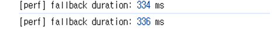

## Demo

https://github.com/user-attachments/assets/92f5c831-9d27-4e81-a800-f5147a44f89b

# TeamSpace

> リアルタイム共同編集とワークスペースの権限・招待システムを備えた、コラボレーション向け SaaS プロジェクト

## 1) プロジェクト概要

**TeamSpace** は、個人・チームのワークスペース内でドキュメントを階層的に管理し、  
複数のユーザーが同じドキュメントを同時に編集できる **リアルタイム共同編集ドキュメントプラットフォーム**です。

- ワークスペース単位のメンバーシップ・権限管理（OWNER/MEMBER/VIEWER）
- ドキュメントツリー（親子関係）構造とページ作成・ナビゲーション
- Liveblocks + BlockNote によるリアルタイムのマルチカーソル・共同編集
- ページ公開切り替えと、トークンベースの読み取り専用共有リンク
- 招待・承認・拒否フロー
- 認証（NextAuth + Credentials/Google）および会員登録
- スナップショットベースの過去バージョン復元［追加開発予定］

## なぜ作ったのか

TeamSpace は、既存のドキュメント共同編集ツールを使う中で感じていた不便さを解消するために始めた個人プロジェクトです。

Google Docs はリアルタイム共同編集に強みがありますが、UI がやや堅く、プロジェクト資料を構造的に整理するには物足りなさがありました。一方、Notion は洗練された UI とブロックベースの編集体験が魅力的ですが、チームで使おうとすると有料プランや利用制限が負担になります。

特にチーム開発やサイドプロジェクトを進める際、次のような課題をよく感じていました。

- チームメンバーを招待しても、ワークスペースの利用制限や料金プランの都合でスムーズに共同作業を続けにくい。
- ドキュメントや資料をまとめて整理したくても、ブロック制限や機能制限によって自由に使いづらい。
- 複数人が同時に作業していても、誰がどの部分を見ているのか分かりにくく、「一緒に作業している」という実感が薄い。
- 学生や就職準備中の人にとっては、少額のサブスクリプションでも負担になりやすく、チーム単位で気軽に始めにくい。

こうした課題を解決するため、TeamSpace は無料で気軽に使える共同作業用ワークスペースを目指して開発しました。ドキュメントを一緒に作成・整理する基本的な共同編集体験を保ちながら、Figma のようにチームメンバーのリアルタイムカーソルを確認できる、より臨場感のあるコラボレーション体験を提供することを目標にしています。

TeamSpace は、大学のチーム課題に取り組む学生、サイドプロジェクトを一緒に進める人たち、ポートフォリオや勉強資料を整理する就職準備中の人たちが、費用を気にせず使えるコラボレーションツールを目指しています。

---

## 2) 主な機能

### 認証 & ユーザー

- NextAuth ベースのログイン（Credentials + Google）
- 会員登録時に個人ワークスペースを自動作成
- パスワードのハッシュ保存（bcrypt）
- Cloudflare Turnstile による Bot 検証

### ワークスペース

- `PERSONAL`, `TEAM` タイプに対応
- ワークスペースの作成・名前変更
- メンバー権限の管理（`OWNER`, `ADMIN`, `MEMBER`, `VIEWER`）
- サイドバーで個人スペースとチームスペースを分けて表示

### ページ（ドキュメント）システム

- ページツリー構造（`parentId` ベース）
- ルートページ・子ページの作成
- タイトル・アイコンの編集
- 公開状態の切り替え（`ispublished`）+ `publictoken` による共有

### リアルタイム共同編集

- Liveblocks Room 単位でページごとのリアルタイムセッションを管理
- BlockNote エディターと連携した同時編集
- VIEWER は読み取り専用、それ以外は FULL_ACCESS
- 未ログインユーザーは公開ページに限りゲストとして読み取り可能

### 招待システム

- メールアドレス prefix ベースのユーザー検索
- ワークスペース招待の作成
- 招待承認時にメンバーシップを自動反映
- 拒否・重複招待・自分自身への招待を防止

---

## 3) 技術スタック

- **Frontend**: Next.js 16 (App Router), React 19, TypeScript
- **UI**: Tailwind CSS v4, shadcn/ui
- **State/Data**: TanStack Query, Zustand
- **Auth**: NextAuth v5(beta), Prisma Adapter
- **DB/ORM**: PostgreSQL, Prisma
- **Realtime**: Liveblocks, BlockNote
- **Validation**: Zod, React Hook Form
- **Infra**: AWS, Terraform , ECS

---

## 4) System Architecture AND CICD WorkFlow

### Architecture Decisions


### 1. ECS Fargate ベースのコンテナ実行環境

アプリケーションの実行環境は **Amazon ECS Fargate** をベースに構成しました。

- サーバーインフラを直接管理する必要がない
- コンテナのデプロイと運用を自動化できる
- サービスのスケーリングと障害復旧に対応できる
- 運用の複雑さを抑え、開発に集中できる

特にサーバー作成、パッチ適用、スケーリングなどの管理作業を AWS に任せられるため、  
運用負荷を最小限にできる点から Fargate を採用しました。

### 2. VPC と Subnet の分離

セキュリティとネットワーク管理のしやすさを考慮し、Public / Private Subnet 構成を採用しました。

| Component   | Subnet         | 目的                 |
| ----------- | -------------- | -------------------- |
| ALB         | Public Subnet  | 外部リクエストの受信 |
| ECS Service | Private Subnet | アプリケーション保護 |

外部に公開するのは ALB のみにし、ECS と RDS は内部ネットワーク内でのみ通信するように構成しました。

### 3. 障害対応とロールバック戦略

本番運用の安定性を高めるため、以下の戦略を採用しました。

- ECS Service による Task の自動復旧
- デプロイ失敗時の以前の Task Definition へのロールバック
- Auto Scaling により最大 4 Task まで拡張可能

これにより、障害発生時にも素早く復旧できる構成にしました。

## 5) アーキテクチャ概要

```text
app/
  ├─ (protected)/dashboard/...        # 認証済みユーザー領域
  ├─ share/[token]/...                # 公開共有ドキュメント（読み取り専用）
  ├─ api/...                          # Route Handlers（API）
server/
  ├─ users/queries.ts                 # ユーザー / サイドバー / アクセス関連 DB クエリ
  ├─ create/queries.ts                # ページ / ワークスペースの作成・編集
  ├─ invite/queries.ts                # 招待フロー
  ├─ page/queries.ts                  # ページ公開切り替え / トークン取得
lib/
  ├─ auth.ts                          # NextAuth 設定
  ├─ prisma.ts                        # Prisma クライアント
  ├─ api/*                            # クライアント fetch ラッパー
prisma/
  ├─ schema.prisma                    # データモデル
```

## 6) 課題・トラブルシューティング

<details>
  <summary>ページ遷移時間を 2200ms から 334ms まで改善</summary>

## 共同編集エディターのパフォーマンス改善事例

---

## 1. プロジェクト概要

本プロジェクトは、Liveblocks を活用したリアルタイム共同編集機能と、  
BlockNote エディターをベースにしたドキュメント編集システムです。

各ドキュメントは pageId を基準に 1 つの Liveblocks room に紐づき、  
ユーザーがドキュメントを切り替えるたびに新しい room に接続して共同編集状態を同期します。

つまり、ドキュメント移動は単なる画面遷移ではなく、  
新しい共同編集セッションに参加する構造になっています。

また、CursorLayer によって、複数のユーザーが同じドキュメントを編集している場合に、  
他のユーザーのマウス位置をリアルタイムで表示する機能も提供しています。

---

## 2. 発生した問題

共同編集エディターを実装した後、ドキュメント切り替え時に次のような問題が発生しました。

- ドキュメントをクリックしても本文がすぐに表示されない
- ユーザー視点では「ドキュメントの表示が遅い」と感じる
- 単純なレンダリング問題なのか、共同編集の同期問題なのか原因の切り分けが難しい

---

## 3. 原因分析の流れ

### 仮説 1. roomId の二重初期化問題

ドキュメント切り替え時に roomId が 2 回変更され、  
Liveblocks room が不要に再初期化されている可能性を疑いました。

特に、URL パラメータがすぐに反映されない場合、  
Zustand の初期値 → 実際の pageId の順に値が変わり、  
room 接続が 2 回発生するのではないかと考えました。

#### 検証結果

- roomId は 1 回だけ正常に変更されていた
- 二重初期化は発生していなかった

### 仮説 2. BlockNote editor の再生成問題

レンダリング過程で editor インスタンスが繰り返し生成されていないか確認しました。

#### 検証結果

- useCreateBlockNote は useMemo ベースで動作していた
- dependency が変更された場合のみ editor が再生成される
- ログを確認した結果、インスタンス再生成が原因ではなかった

---

## 4. 1 次対応: 構造分離

初期分析の段階では明確な原因を特定しきれなかったため、  
まずは初期レンダリング性能の改善に集中しました。

> 「ドキュメント表示」と「共同編集機能」を分離する。

- Viewer: 初期表示を高速に担当
- Editor: 共同編集が必要になったタイミングでのみ有効化

このため、次のような構成を設計しました。

- DB にドキュメント snapshot を保存
- ページアクセス時は snapshot ベースの Viewer を先にレンダリング
- 編集開始時のみ Liveblocks + Editor をマウント
- 共同編集中の変更内容は debounce 後に snapshot として保存

この構成を実装している途中で、  
それまで把握できていなかった追加のパフォーマンスボトルネックを発見しました。

---

## 5. 追加ボトルネックの発見: CursorLayer

CursorLayer は内部的に、  
BlockNoteView をラップする DOM の getBoundingClientRect() を基準に  
レイアウト計算を行っていました。

しかし、1 次対応を進める過程で CursorLayer を一時的に無効化したところ、  
room への参加速度が明らかに改善されることを確認しました。

---

## 6. CursorLayer のパフォーマンス問題分析

### 問題の症状

- ドキュメント初回アクセス時の読み込み速度が低下
- Liveblocks room への接続が遅れる
- エディター内容が表示されるまでの体感遅延が増える

### 1) 初期ロード時に処理コストが集中

ドキュメントアクセス直後に、次の処理が同時に実行されていました。

- room 接続
- storage sync
- editor 初期化
- presence 状態同期（カーソルを含む）
- layout 計算

→ 初期ロード時点にすべてのコストが集中していた

### 2. 実行タイミングの問題

- provider 接続前に useOthers() が呼ばれていた
- 他ユーザー情報がない状態でアクセスしようとしていた
- 一部の状況で null 関連エラーが発生していた

→ CursorLayer が早すぎるタイミングで実行されていた

---

## 7. 解決方針

### 1) CursorLayer の遅延有効化

初回アクセス時は CursorLayer を無効化し、  
一定時間が経過した後に有効化するよう変更しました。

パフォーマンス測定では、Suspense = Loading UI がどれくらい長く表示されたかを基準に  
初期ロード時間を計測しました。


共同編集環境の初期化時間: 約 2.2 秒

この結果をもとに安全マージンを含めて、  
3 秒後に CursorLayer を有効化するようにしました。

### 2. 固定遅延方式の限界

ネットワーク環境によって初期化時間は変わるため、  
固定の遅延時間では状況によって正確に動作しない問題がありました。

### 3. 最終的な改善方式

より安定して処理するため、次のように構造を改善しました。

- Liveblocks が提供するエディター準備完了状態を知らせる API を活用
- 初期レイアウト計算の完了状態もあわせて考慮
- Zustand のグローバル状態で準備状況を管理

つまり、

- editor の準備完了
- layout 計算完了

この 2 つの条件をどちらも満たした時点でのみ CursorLayer を有効化するよう変更しました。

---

## 8. 最終構成と結果

最終的には、次のような構成に改善しました。

- Cursor 状態を Zustand のグローバル状態で管理
- ページ移動時に CursorLayer を強制的に無効化
- 新しいページに入った後、準備状態を確認してから有効化

### 結果



- 初期ドキュメント読み込み速度: 2200ms → 334ms に改善
- room 参加速度: CursorLayer 無効化時と同等レベルまで回復

</details>

<details>
  <summary>ドキュメント切り替え時の Tree UI のちらつきを状態設計の見直しで解決</summary>

## 1. 発生した問題


サイドバーの Tree UI でドキュメントを切り替える際に flickering が発生しました。  
特にキャッシュされていない状態では、別のドキュメントへ移動した瞬間に Tree が一瞬空になってから再レンダリングされ、ナビゲーションの流れが途切れて見える問題がありました。

- キャッシュ済みの状態: ちらつきなし
- 未キャッシュの状態: ドキュメント切り替え時に Tree UI が一瞬空になった後、再レンダリングされる

---

## 2. 原因調査の流れ

当初は React Query の refetch や条件付きレンダリングが主な原因ではないかと疑いました。  
しかし検証の結果、これらは現象を一部悪化させる要因ではあるものの、根本原因ではありませんでした。

### 1) React Query refetch の影響確認

ドキュメント切り替え時に React Query の refetch が発生し、Tree コンポーネントの再レンダリングを引き起こしていると考えました。  
これを検証するため、staleTime を長めに設定してキャッシュ再利用時間を確保し、不要なリクエストを減らしました。

> **ancestorPath**: 現在のドキュメントまでの親ノード経路を持つ配列

結果として、同じ ancestorPath を共有するドキュメント間の切り替えではちらつきが緩和されましたが、根本的な解決には至りませんでした。

### 2) 条件付きレンダリングの影響確認

データがまだ用意されていないタイミングでコンポーネントが消え、Tree UI が一瞬空になる可能性を確認しました。  
そこでコンポーネント自体は維持し、optional chaining によってデータアクセスだけを安全に処理するよう変更しました。

その結果、UI の空白は一部減りましたが、flickering 自体はまだ発生していました。

### 3) 状態構造の問題分析

最終的に確認した核心的な原因は、ancestorPath の渡し方でした。  
従来は ancestorPath を props として子コンポーネントに渡していましたが、ドキュメントをクリックするたびに新しい配列インスタンスが作成されていました。  
React は配列の参照値が変わると新しい値として認識するため、この過程で Tree 全体が再レンダリングされ、flickering が発生していました。

---

## 3. 構造改善

従来の構造では、現在のドキュメントの ancestorPath に該当するノードだけが開き、別のドキュメントをクリックすると、以前開いていたノードはすべて閉じていました。  
しかしユーザー体験としては、一度開いたノードがドキュメント移動後も維持される方が自然だと判断しました。

最初は Zustand と Set を使って open 状態を管理する方法を検討しました。  
ただし Set は特定ノードの open 状態を管理するには使いやすい一方で、今後ノードごとの状態を拡張したり追加情報を持たせたりするには限界があると判断しました。  
また ancestorPath によって開かれたノードだけでなく、ユーザーが手動で開いたノードも一緒に維持する必要がありました。

そのため、最終的には Object ベースの状態管理を採用しました。

- 開いているノードをオブジェクトの key として管理
- 新しいドキュメントを選択しても既存の open 状態を維持
- ドキュメント切り替え時に必要なノードだけを追加で open にする

この構成に変更したことで、Tree の open 状態をより安定して管理できるようになりました。

---

## 4. 追加課題と最終解決

構造を変更した後も flickering が完全には消えず、open/close 動作がまれに不安定になる問題が残っていました。

原因を追跡した結果、open 状態を依存配列に含めた useEffect が状態変更のたびに再実行され、ancestorPath ベースの初期化ロジックが繰り返し適用されていました。  
その結果、状態が何度も上書きされ、不要なレンダリングが繰り返されて UI が不安定になっていました。

これを解決するため、初期化ロジックと状態変更ロジックを分離しました。

- 初回アクセス時のみ ancestorPath を基準に open 状態を初期化
- それ以降はユーザー操作によってのみ状態を変更

このように分離したことで、不要な状態更新がなくなり、open/close 動作も安定しました。

---

## 5. 結果

- ドキュメント切り替え時の Tree UI flickering を解消
- 以前開いていたノードの open 状態を安定して維持
- open/close 動作のまれな不具合を解消
- 不要な再レンダリングを減らし、ドキュメント探索 UX を改善
  </details>

<details>
  <summary>Next.js App Router でブラウザ依存ライブラリ（BlockNote）を使った際の window is not defined 問題と解決</summary>

## 概要

Next.js App Router 環境で **BlockNote + Liveblocks ベースのエディター**を導入していたところ、  
ブラウザ専用 API へのアクセスが原因でランタイムエラーが発生しました。

---

## エラーメッセージ

```bash
Runtime Error: window is not defined
```

---

## 問題の原因

当初は `'use client'` を宣言すれば、そのコンポーネントは完全にクライアント専用として動作するため、ブラウザ関連コードはサーバーで実行されないと考えていました。

しかし実際には、そう単純ではありませんでした。

> [!IMPORTANT]
> Next.js App Router における `'use client'` は、そのファイルを **Client Component として指定するための宣言**です。  
> ただし、ブラウザ専用ライブラリのすべての初期化処理がサーバーと完全に切り離されることまで保証するものではありません。

### 衝突が発生しやすい代表例

- ライブラリが **import 時点**で `window`, `document` を参照する場合
- hook の呼び出しや初期化処理の中でブラウザ API にアクセスする場合
- 外部ライブラリ自体が **SSR-safe ではない**場合

### 今回のケースでの原因

BlockNote は内部的に `window`, `document` などのブラウザ API に依存しており、  
エディター初期化ロジックもブラウザ環境を前提に動作していました。

その結果、関連コードが **サーバーレンダリングまたはサーバー評価の経路**で安全に処理されず、最終的に次のエラーが発生しました。

```bash
ReferenceError: window is not defined
```

> [!NOTE]
> つまり、`'use client'` を使ったからといって、ブラウザ専用コードが常にクライアント側だけで安全に実行されるとは限りません。  
> ライブラリの初期化タイミングや import 構造によっては、SSR 経路と衝突する可能性があります。

---

## 解決方法

問題の本質は `window` チェックそのものではなく、  
**ブラウザ依存度の高いエディターコンポーネントを SSR 経路から完全に切り離すこと**でした。

そのため、Next.js の `dynamic import` を使い、エディターコンポーネントをクライアント側でのみ読み込むよう変更しました。

```tsx
import dynamic from 'next/dynamic';

const Editor = dynamic(() => import('../../Editor').then((m) => m.Editor), {
  ssr: false,
});
```

### なぜこの方法が必要なのか

`ssr: false` を設定すると、そのコンポーネントは **サーバーレンダリング対象から除外**されます。  
そのため、ブラウザ環境が保証された後にのみ読み込まれ、`window` や `document` を使用するライブラリとの衝突を防げます。

> [!TIP]
> BlockNote のようにブラウザ API への依存が強いライブラリでは、`dynamic import + ssr: false` の組み合わせが最も安全です。

---

## 結果

- `window is not defined` エラーを解消
- BlockNote + Liveblocks エディターが正常に動作
- SSR 環境とブラウザ専用ロジックを明確に分離した構造へ改善

---

## 最終まとめ

今回の問題から確認できた核心は次の通りです。

### 重要ポイント

- `'use client'` は **Client Component の宣言**のためのものです。
- しかし、ブラウザ API を使用する外部ライブラリの SSR 安全性まで保証するものではありません。
- そのため、ブラウザ依存度の高いライブラリでは、以下の項目を必ず確認する必要があります。

### チェックリスト

- そのライブラリが **SSR 環境で安全に動作するか**
- **import 時点**でブラウザオブジェクトを参照していないか
- 必要であれば `dynamic import` + `ssr: false` によって **完全にクライアント専用として分離すべきか**

---

## 結論

今回の問題は、単に `'use client'` を宣言するだけで解決できるものではありませんでした。

BlockNote のようにブラウザ環境へ強く依存するライブラリは、  
必要に応じて `dynamic import` と `ssr: false` を使い、**SSR レンダリング経路から明確に切り離す**ことで安定して動作させることができます。

</details>

<details>
  <summary>リアルタイム共同編集カーソルの位置ずれ問題を解決</summary>

## 1. 発生した問題

リアルタイム共同編集エディターで他ユーザーのカーソルを表示する機能を実装する中で、  
**同じマウス位置であるにもかかわらず、ユーザーごとにカーソル位置が違って見える問題**が発生しました。

エディターは画面中央揃えのレイアウトで、各ユーザーのブラウザ幅によって左右の `margin` 値が変わる構造でした。  
そのため、同じ `viewport` 座標を基準に計算しても、実際のエディター内部基準の座標はユーザーごとに異なっていました。

結果として、**同じ場所を指しているはずなのに、カーソルがそれぞれ違う位置に表示される問題**が発生しました。

---

## 2. 初期アプローチと限界

最初は次のような方法で実装していました。

- `viewport` 基準の座標からナビゲーション領域を除外する
- 残った値を比率に変換し、他ユーザーの画面上で復元する

この方法はシンプルで直感的に見えましたが、根本的な限界がありました。

- 座標の基準が **エディターではなく画面全体（`viewport`）** だった
- ブラウザサイズやモニター環境が異なると、比率ベースの復元でも誤差が蓄積された

つまり、この方法は正しい座標系を設計したのではなく、  
**誤った座標系を前提に補正だけを試みる構造**でした。

---

## 3. 解決方針: 座標系をエディター基準に再定義

問題を解決するため、座標の基準を `viewport` ではなく  
**エディター領域（`rect`）基準**に変更しました。

そのために、次の方法を適用しました。

- `ResizeObserver`
- `scroll` イベント
- `resize` イベント

これらのイベントを使ってエディターの `bounding rect` が変化するたびに基準領域を更新し、  
カーソル座標を **エディター基準の相対座標**として計算・送信するよう修正しました。

この方式に変更したことで、次の効果が得られました。

- ブラウザサイズが違っても同じ基準を維持できる
- スクロール中でも正確に位置を復元できる
- ユーザー環境の差によって発生していた座標ずれを解消できる

---

## 4. パフォーマンス問題: state ベースの rect 管理の限界

座標基準の問題を解決した後、新たな問題が発生しました。  
エディターの `rect` 値を React `state` で管理したことで、**過剰な再レンダリング**が発生したのです。

### 問題の状況

- `scroll` または `resize` が発生するたびに `rect` 値が頻繁に変わる
- `state` 更新によりコンポーネントの再レンダリングが発生する
- その結果、カーソル位置が変わるたびにレンダリングコストが急増する

特に次の構造が問題でした。

- `EditorWrapper` 内部で `<Editor />` を直接生成していた
- `EditorWrapper` の `state` が変わるたびに `Editor` も一緒に再生成されていた

React では element の参照が変わると、その subtree 全体が reconciliation の対象になります。  
そのため、実際には関係のない変更でも **不要な再レンダリング**が発生していました。

---

## 5. 構造改善: 参照の安定性を確保

この問題を解決するため、コンポーネント構造を変更しました。

- `<Editor />` を `children` として外部で生成するように変更
- `EditorWrapper` は wrapper としての役割だけを持つように単純化

重要なのは、`children` パターン自体が最適化テクニックであるというより、  
**子 element の生成位置を上位へ移動し、参照の安定性を確保したこと**です。

この変更により、`Editor` の不要な再レンダリングを防ぐことができました。

---

## 6. 追加最適化: state の排除とレンダリングコスト削減

構造を改善した後も、`rect` 値を継続的に `state` で管理する方式にはまだ負荷がありました。  
そこで状態管理の方法自体を見直しました。

### 変更内容

- `rect` 関連の値は React `state` ではなく **CSS Custom Property** で管理
- カーソル移動には `transform: translate3d(...)` を使用

### 適用効果

- React `state` 更新をなくし、再レンダリングを最小化
- GPU アクセラレーションを活用し、カーソル移動がより滑らかに動作
- メインスレッドの負荷が軽減され、体感性能が向上

結果として、カーソル移動が以前よりも自然で安定して動作するようになりました。

---

## 7. モバイル環境での課題と対応

最後に、モバイル環境では別の問題が発生しました。

- 画面幅が狭くなることでテキストが折り返される
- 同じ座標を指していても、実際には別の文字位置を指してしまう

この問題は単なる座標計算の問題ではなく、  
**レイアウトそのものが変わる問題**でした。

### 判断

すべてのユーザーに同じテキスト位置を保証するには、  
基本的に同一のレイアウト条件が必要でした。

しかしモバイル環境まで完全に対応しようとすると、改行・幅・テキストフローまで揃える必要があり、  
実装の複雑度が大きく上がります。

### 結論

そのため、次の方針に整理しました。

- エディターの `width` を固定する
- 機能の対応範囲をデスクトップ環境に限定する

これにより、すべてのユーザーに同じ基準座標を適用でき、  
最終的に座標復元の精度を安定して確保できました。

---

## 8. 最終結果

最終的に、次の成果が得られました。

- エディター基準の座標系に統一
- `resize` / `scroll` 状況でも安定して位置を復元
- React の再レンダリングを最小化
- GPU アクセラレーションによる滑らかなカーソル移動を実現

結果として、  
**ユーザー環境の違いがあっても、正確で自然なリアルタイム共同編集カーソル機能を実装できました。**

---

## 9. 要点整理

この問題の本質は、単なる座標ずれではなく、次の 3 つが複合的に絡み合ったものでした。

- 誤った座標系の選択（`viewport` 基準）
- 状態管理方式によるレンダリングコスト増加
- ユーザー環境によるレイアウト不一致

そして、これを解決するうえで重要だった点は次の通りです。

- 座標系を **エディター基準に再定義**した
- 参照の安定性を確保し、**不要な再レンダリングを排除**した
- `state` ではなく **CSS + `transform` ベースでレンダリングを最適化**した

今回の対応を通じて、単に座標計算ロジックを修正するだけでなく、  
**座標系・レンダリング構造・レイアウト条件まで含めて設計してこそ、リアルタイム共同編集機能を安定して実装できる**ことを確認しました。

</details>

<details>
  <summary>コンテナは Ready、ALB は Unhealthy => ALB と Target Group 間の Availability Zone（AZ）不一致問題</summary>
  health check 失敗の原因を探すために、SG、NACL、ポートマッピング、Target Group、NAT Gateway、Route Table まで全部疑い、一日中ハマった記録です。  
  結局、原因は ALB と ECS Target の AZ 不一致でした。  
  https://qiita.com/donghyun95/items/08443ca4ca8eef42ae40
</details>

<details>
  <summary>Terraform Remote State なしで GitHub Actions だけを使っていたら destroy で苦戦した話</summary>
  「デプロイはうまくいくのに、なぜ destroy はできないのか？」から始まり、  
  variable、provider credential、import、state の問題まで連鎖的に経験した記録です。  
  最終的に、Terraform はコードではなく state を基準に動作するものだと身をもって理解しました。  
  https://qiita.com/donghyun95/items/b399440c14a160c9b8f0 
</details>

その他の内容も Qiita で共有しています。 https://qiita.com/donghyun95
